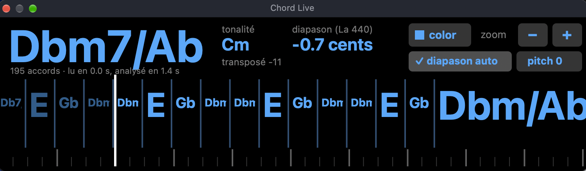
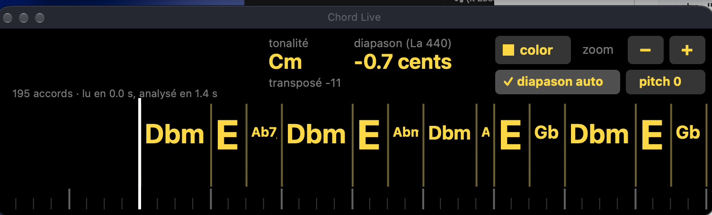

<h1 align="center">Chord Live for VirtualDJ</h1>

<b>V1.4</b> · VirtualDJ plugin · macOS (Apple Silicon) · Windows (x64)

<a href="https://www.paypal.com/paypalme/owfrappier"><b>☕ DONATE (PayPal)</b></a>

---

🇬🇧 [English](#english) · 🇫🇷 [Français](#français)

---

## English

**Chord Live** is a free VirtualDJ effect that **analyses the loaded track live** and shows its chords while you play, in its own floating window:

- 🎹 **Chords** aligned on VirtualDJ's beat grid (7ths, maj7, dim/dim7, m7b5, 6th and suspended chords, inversions, chromatic bass lines). The current chord in big letters, the next ones **scrolling** under a vertical playhead, like the waveform.
- 🔑 **Key** of the track, and 🎚️ **fine tuning** measured to the cent against A = 440 Hz.
- ✅ **Auto tuning**: the track is brought to A = 440 Hz with `key_smooth` — **the tempo does not change**, with or without Master Tempo, and **your own transposition is kept** (deck at +2 → stays +2, in tune).
- **pitch 0** button (resets the pitch fader), **zoom** (− / +), **7 colours**, follows the deck's transposition.
- **Nothing is written** to your VirtualDJ database or to your files. The original audio file is read from disk (MP3, AAC/M4A, ALAC, AIFF, WAV, FLAC, Ogg Vorbis, and the audio of MP4/MOV/M4V videos; Windows also WMA/WMV; MKV, WEBM, AVI, FLV, MPG, VOB, APE, MPC… if [ffmpeg](https://ffmpeg.org) is installed: `brew install ffmpeg` on Mac, `winget install ffmpeg` on Windows), so pitch, transposition and Master Tempo never affect the analysis. If a format is not recognised, the window says so: please contact support (GitHub Issues).

It uses the analysis engine of [Chord Injector for VirtualDJ](https://github.com/owfrappier/Chord-Injector-for-VirtualDJ), which writes chords, tuning and key into the VirtualDJ database for a whole library.

### Install (VirtualDJ closed)

Download the latest version in **[Releases](https://github.com/owfrappier/VIRTUALDJ-CHORDS-PLUGIN/releases/latest)**.

- **macOS (Apple Silicon)**: unzip `Chord-Live-for-VirtualDJ-…-macOS.zip` (signed and notarised by Apple) and copy `ChordLive.bundle` to
  `~/Library/Application Support/VirtualDJ/PluginsMacArm/SoundEffect/`
  (Finder: Go → Go to Folder…, paste the path; create `SoundEffect` if it does not exist).
- **Windows**: copy `ChordLive.dll` to
  `%LOCALAPPDATA%\VirtualDJ\Plugins64\SoundEffect\`
  (Windows + R, paste the path; create `SoundEffect` if it does not exist — not in `Visualisation`).
  Older installations may use `Documents\VirtualDJ\Plugins64\SoundEffect\`.

Start VirtualDJ, choose **Chord Live** in the effects of a deck and open its window. The analysis takes a few seconds per track.

---

## Français

**Chord Live** est un effet VirtualDJ gratuit qui **analyse en direct le morceau chargé** et affiche ses accords pendant que vous jouez, dans sa propre fenêtre flottante :

- 🎹 **Les accords** calés sur la grille de beats de VirtualDJ (7e, maj7, dim/dim7, m7b5, 6te et sus, renversements, lignes de basse chromatiques). L'accord en cours en grand, les suivants qui **défilent** sous une tête de lecture verticale, comme la forme d'onde.
- 🔑 **La tonalité**, et 🎚️ **l'écart de diapason** mesuré au cent près par rapport au La 440.
- ✅ **Diapason auto** : le morceau est ramené à La = 440 Hz avec `key_smooth` — **le tempo ne change pas**, avec ou sans Master Tempo, et **votre transposition est conservée** (platine à +2 → reste à +2, juste).
- Bouton **pitch 0** (remet le pitch fader à zéro), **zoom** (− / +), **7 couleurs**, suit la transposition de la platine.
- **Rien n'est écrit** dans votre base VirtualDJ ni dans vos fichiers. Le fichier audio original est lu sur le disque (MP3, AAC/M4A, ALAC, AIFF, WAV, FLAC, Ogg Vorbis, et l'audio des vidéos MP4/MOV/M4V ; sous Windows aussi WMA/WMV ; MKV, WEBM, AVI, FLV, MPG, VOB, APE, MPC… si [ffmpeg](https://ffmpeg.org) est installé : `brew install ffmpeg` sur Mac, `winget install ffmpeg` sous Windows) : le pitch, la transposition et le Master Tempo n'ont aucun effet sur l'analyse. Si un format n'est pas reconnu, la fenêtre l'indique : contactez le support (GitHub Issues).

Il utilise le moteur d'analyse de [Chord Injector for VirtualDJ](https://github.com/owfrappier/Chord-Injector-for-VirtualDJ), qui écrit accords, diapason et tonalité dans la base VirtualDJ pour toute une bibliothèque.

### Installation (VirtualDJ fermé)

Dernière version dans **[Releases](https://github.com/owfrappier/VIRTUALDJ-CHORDS-PLUGIN/releases/latest)**.

- **macOS (Apple Silicon)** : décompressez `Chord-Live-for-VirtualDJ-…-macOS.zip` (signé et notarisé par Apple) et copiez `ChordLive.bundle` dans
  `~/Library/Application Support/VirtualDJ/PluginsMacArm/SoundEffect/`
  (Finder : Aller → Aller au dossier…, collez le chemin ; créez `SoundEffect` s'il n'existe pas).
- **Windows** : copiez `ChordLive.dll` dans
  `%LOCALAPPDATA%\VirtualDJ\Plugins64\SoundEffect\`
  (Windows + R, collez le chemin ; créez `SoundEffect` s'il n'existe pas — pas dans `Visualisation`).
  Sur une ancienne installation : `Documents\VirtualDJ\Plugins64\SoundEffect\`.

Lancez VirtualDJ, choisissez **Chord Live** dans les effets d'une platine et ouvrez sa fenêtre. L'analyse prend quelques secondes par morceau.

---

© Olivier FRAPPIER 2026 · [DONATE](https://www.paypal.com/paypalme/owfrappier)

*Chord Live for VirtualDJ is a free initiative by a VirtualDJ fan. It is an independent product and is not affiliated with, endorsed by or sponsored by VirtualDJ or Atomix Productions. VirtualDJ is a trademark of Atomix Productions.*
