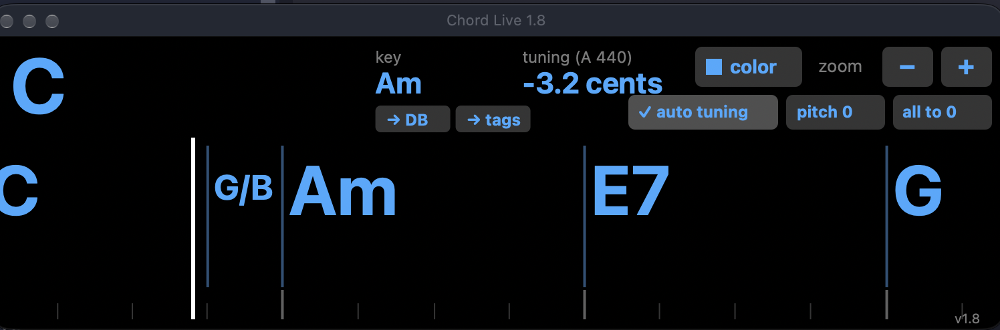
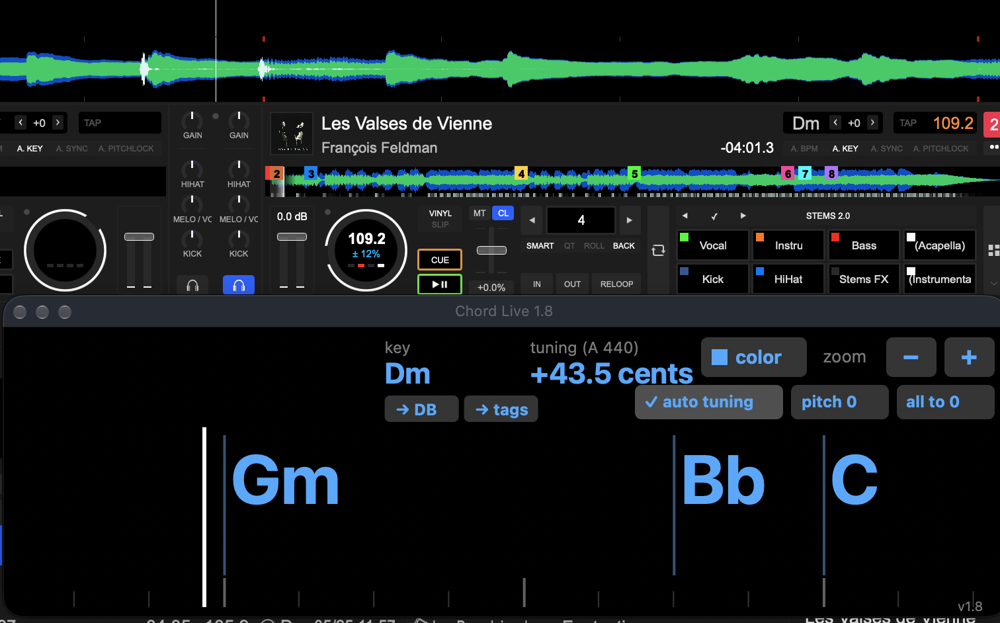
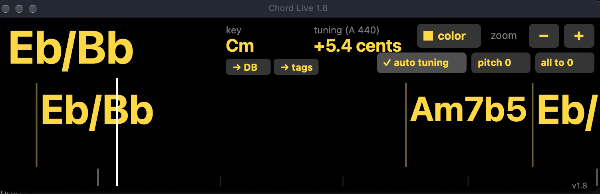

<h1 align="center">Chord Live for VirtualDJ</h1>
<p align="center"><b>V2.0</b> · VirtualDJ plugin · macOS (Apple Silicon) · Windows (x64)</p>
<p align="center"><a href="https://www.paypal.com/paypalme/owfrappier"><b>☕ DONATE (PayPal)</b></a></p>


https://github.com/user-attachments/assets/a7a9e44f-ef66-474a-b8f0-74a5afbe2023


<p align="center"></p>
<p align="center"></p>
<p align="center"></p>
---

🇬🇧 [English](#english) · 🇫🇷 [Français](#français)

---

## English

**Chord Live** is a free VirtualDJ effect that **analyses the loaded track live** and shows its chords while you play, in its own floating window:

- 🎹 **Chords** aligned on VirtualDJ's beat grid (7ths, maj7, dim/dim7, m7b5, 6th and suspended chords, inversions, chromatic bass lines). The current chord in big letters, the next ones **scrolling** under a vertical playhead, like the waveform.
- 🔑 **Key** of the track, and 🎚️ **fine tuning** measured to the cent against A = 440 Hz.
- ✅ **Auto tuning**: the track is brought to A = 440 Hz with `key_smooth` — **the tempo does not change**, with or without Master Tempo, and **your own transposition is kept** (deck at +2 → stays +2, in tune).
- **pitch 0** (tempo back to the original) and **all to 0** (tempo and key back to the original, auto tuning kept) buttons, **zoom** (− / +), **7 colours**, follows the deck's transposition.
- **→ DB / → tags** (right under the key): write the detected key into VirtualDJ's database, or also into the audio file's tag. VirtualDJ itself does the writing (safe, even while it is running), only when you click; the button turns green once VirtualDJ shows the new key.
- 🌊 **New in V2.0 — chords scrolling over VirtualDJ's own waveform**, in sync with the track, on each deck (macOS and Windows). Turn it on with a custom button `effect_button 'ChordLive' 6`; the first time, adjust the layer on the deck's waveform band (drag, corner = size, wheel = scale, then OK) — right-click / `effect_button 'ChordLive' 7` to adjust again. It follows window resizing and full screen.
- 🧩 **New in V2.0 — skin integration**: every function and live text (current chord, next 6 chords, beats left, key, tuning, harmonic match with the other deck…) is available to skins and controllers — see [Skin integration](#skin-integration-v20--intégration-dans-un-skin) below. Chord Live keeps working with its window closed.
- **Nothing is written** to your VirtualDJ database or to your files unless you click → DB / → tags. The audio is decoded by **VirtualDJ itself** (every format it can play, videos included), from the original sound before pitch, key and Master Tempo, while the track plays. If the track is not playing, Chord Live reads the original file from disk instead (MP3, AAC/M4A, ALAC, AIFF, WAV, FLAC, Ogg Vorbis, MP4/MOV/M4V audio; Windows also WMA/WMV; other formats if [ffmpeg](https://ffmpeg.org) is installed).

It uses the analysis engine of [Chord Injector for VirtualDJ](https://github.com/owfrappier/Chord-Injector-for-VirtualDJ), which writes chords, tuning and key into the VirtualDJ database for a whole library.

### Install (VirtualDJ closed)

Download the latest version in **[Releases](https://github.com/owfrappier/VIRTUALDJ-CHORDS-PLUGIN/releases/latest)**.

- **macOS (Apple Silicon)**: open `Chord-Live-for-VirtualDJ-…-macOS.pkg` (signed and notarised by Apple) and follow the installer. It installs `ChordLive.bundle` in
  `~/Library/Application Support/VirtualDJ/PluginsMacArm/SoundEffect/` for the logged-in user.
- **Windows**: copy `ChordLive.dll` to
  `%LOCALAPPDATA%\VirtualDJ\Plugins64\SoundEffect\`
  (Windows + R, paste the path; create `SoundEffect` if it does not exist — not in `Visualisation`).
  Older installations may use `Documents\VirtualDJ\Plugins64\SoundEffect\`.

Start VirtualDJ, choose **Chord Live** in the effects of a deck and open its window. The analysis takes a few seconds per track.

💡 **One-click button**: in your skin, edit a custom button (right-click → Edit) and give it the action
`effect_active 'ChordLive' & effect_active 'ChordLive' ? effect_show_gui 'ChordLive' : nothing`
— one click turns Chord Live on for the deck and opens its window, a second click turns it off.

---

## Français

**Chord Live** est un effet VirtualDJ gratuit qui **analyse en direct le morceau chargé** et affiche ses accords pendant que vous jouez, dans sa propre fenêtre flottante :

- 🎹 **Les accords** calés sur la grille de beats de VirtualDJ (7e, maj7, dim/dim7, m7b5, 6te et sus, renversements, lignes de basse chromatiques). L'accord en cours en grand, les suivants qui **défilent** sous une tête de lecture verticale, comme la forme d'onde.
- 🔑 **La tonalité**, et 🎚️ **l'écart de diapason** mesuré au cent près par rapport au La 440.
- ✅ **Auto tuning** (diapason auto) : le morceau est ramené à La = 440 Hz avec `key_smooth` — **le tempo ne change pas**, avec ou sans Master Tempo, et **votre transposition est conservée** (platine à +2 → reste à +2, juste).
- Boutons **pitch 0** (tempo d'origine) et **all to 0** (tempo et tonalité d'origine, diapason auto conservé), **zoom** (− / +), **7 couleurs**, suit la transposition de la platine.
- **→ DB / → tags** (juste sous la tonalité) : écrit la tonalité trouvée dans la base de VirtualDJ, ou aussi dans le tag du fichier audio. C'est VirtualDJ lui-même qui écrit (sans risque, même pendant qu'il tourne), seulement sur clic ; le bouton passe au vert quand VirtualDJ affiche la nouvelle tonalité.
- 🌊 **Nouveau en V2.0 — les accords défilent sur la forme d'onde de VirtualDJ**, en synchro avec le morceau, sur chaque platine (macOS et Windows). Activez-les avec un custom button `effect_button 'ChordLive' 6` ; la première fois, calez le calque sur la bande de la forme d'onde (glisser, coin = taille, molette = échelle, puis OK) — `effect_button 'ChordLive' 7` pour le refaire. Il suit le redimensionnement et le plein écran.
- 🧩 **Nouveau en V2.0 — intégration dans les skins** : toutes les fonctions et les textes en direct (accord en cours, 6 suivants, temps restants, tonalité, diapason, compatibilité avec l'autre platine…) sont disponibles pour les skins et les contrôleurs — voir [Intégration dans un skin](#skin-integration-v20--intégration-dans-un-skin) plus bas. Chord Live fonctionne aussi fenêtre fermée.
- **Rien n'est écrit** dans votre base VirtualDJ ni dans vos fichiers, sauf si vous cliquez sur → DB / → tags. L'audio est décodé par **VirtualDJ lui-même** (tous les formats qu'il sait lire, vidéos comprises), sur le son original avant pitch, tonalité et Master Tempo, pendant la lecture du morceau. Si le morceau ne joue pas, Chord Live lit le fichier original sur le disque (MP3, AAC/M4A, ALAC, AIFF, WAV, FLAC, Ogg Vorbis, audio des MP4/MOV/M4V ; sous Windows aussi WMA/WMV ; autres formats si [ffmpeg](https://ffmpeg.org) est installé).

Il utilise le moteur d'analyse de [Chord Injector for VirtualDJ](https://github.com/owfrappier/Chord-Injector-for-VirtualDJ), qui écrit accords, diapason et tonalité dans la base VirtualDJ pour toute une bibliothèque.

### Installation (VirtualDJ fermé)

Dernière version dans **[Releases](https://github.com/owfrappier/VIRTUALDJ-CHORDS-PLUGIN/releases/latest)**.

- **macOS (Apple Silicon)** : ouvrez `Chord-Live-for-VirtualDJ-…-macOS.pkg` (signé et notarisé par Apple) et suivez l'installeur. Il installe `ChordLive.bundle` dans
  `~/Library/Application Support/VirtualDJ/PluginsMacArm/SoundEffect/` pour l'utilisateur connecté.
- **Windows** : copiez `ChordLive.dll` dans
  `%LOCALAPPDATA%\VirtualDJ\Plugins64\SoundEffect\`
  (Windows + R, collez le chemin ; créez `SoundEffect` s'il n'existe pas — pas dans `Visualisation`).
  Sur une ancienne installation : `Documents\VirtualDJ\Plugins64\SoundEffect\`.

Lancez VirtualDJ, choisissez **Chord Live** dans les effets d'une platine et ouvrez sa fenêtre. L'analyse prend quelques secondes par morceau.

💡 **Bouton en un clic** : dans votre skin, modifiez un custom button (clic droit → Edit) et donnez-lui l'action
`effect_active 'ChordLive' & effect_active 'ChordLive' ? effect_show_gui 'ChordLive' : nothing`
— un clic active Chord Live sur la platine et ouvre sa fenêtre, un second clic le coupe.

---

## Skin integration (V2.0+) · Intégration dans un skin

Every Chord Live function can be used from **any skin, custom button or controller mapping**, with VDJScript. Commands act on the deck they are placed in (`<deck deck="1">` in a skin, or prefix them with `deck 1 …`). Chord Live must be active on that deck: it analyses the track and updates its texts about 10 times per second, with or without its window.
*Toutes les fonctions de Chord Live sont utilisables depuis **n'importe quel skin, custom button ou mapping de contrôleur**, en VDJScript. Les commandes agissent sur la platine où elles sont placées (`<deck deck="1">` dans un skin, ou préfixe `deck 1 …`). Chord Live doit être actif sur cette platine.*

### Activate and show · Activer et afficher
| Command | Action |
|---|---|
| `effect_active 'ChordLive'` | Turn Chord Live on / off on the deck (also a query: lit when active) · *active / coupe* |
| `effect_active 'ChordLive' & effect_active 'ChordLive' ? effect_show_gui 'ChordLive' : nothing` | One-click button: on + window, second click off · *bouton en un clic* |
| `effect_show_gui 'ChordLive'` | Show / hide the Chord Live window (also a query) · *fenêtre on / off* |

### Buttons · Boutons — `effect_button 'ChordLive' N`
| N | Action |
|---|---|
| 1 | Auto tuning on / off (track brought to A = 440 Hz, tempo unchanged) · *diapason auto* |
| 2 | Pitch 0 (original tempo, key untouched) · *tempo d'origine* |
| 3 | All to 0 (original tempo and key, auto tuning kept) · *tout à 0* |
| 4 | Write the detected key to VirtualDJ's database · *tonalité → base* |
| 5 | Write the detected key to the database and the file's tag · *tonalité → tags* |
| 6 | Chords scrolling over the deck's waveform on / off (first time: adjustment) · *accords sur la forme d'onde* |
| 7 | Adjust the waveform chords (position, size, scale) · *réglage du calque* |

### Texts · Textes — `get_effect_string 'ChordLive' N`
| N | Content | Example |
|---|---|---|
| 1 | Current chord (with the deck's transposition) · *accord en cours* | `Am7` |
| 2–7 | Next 6 chords · *6 accords suivants* | `F`, `G`, `C/E`… |
| 8 | Beats left in the current chord · *temps restants* | `3` |
| 9–14 | Length in beats of next chords 1–6 · *durée des suivants* | `4` |
| 15 | Key heard (transposition included) · *tonalité entendue* | `Bm` |
| 16 | Comparison with VirtualDJ's key · *comparaison avec VirtualDJ* | `✓ VDJ` / `VDJ: D` |
| 17 | Tuning · *diapason* | `+12.3 c` / `in tune` |
| 18 | Auto tuning state · *état du diapason auto* | `on` / `off` |
| 19 | Analysis status (empty when ready) · *état de l'analyse* | `Decoding with VirtualDJ… 42 %` |
| 20 | Harmonic match with the other deck running Chord Live · *compatibilité* | `✓ B: Em` / `~ B: A` / `✗ B: F` |
| 21 | Match level, for colours · *niveau* | `good` / `ok` / `bad` |
| 22 | Next key change · *prochain changement de tonalité* | `→ C#m 2:31` |
| 23 | Key writing result · *résultat de l'écriture* | `DB ✓`, `tags …` |
| 24 | Waveform chords state · *calque* | `on` / `off` |

### Examples · Exemples
```xml
<!-- current chord, big, with the beats left -->
<textzone><pos x="+0" y="+0"/><size width="120" height="40"/>
  <text fontsize="32" weight="bold" color="#ffd02a" action="get_effect_string 'ChordLive' 1"/></textzone>
<textzone><pos x="+120" y="+4"/><size width="30" height="16"/>
  <text fontsize="12" color="white" action="get_effect_string 'ChordLive' 8"/></textzone>

<!-- auto tuning button, lit when on -->
<button action="effect_button 'ChordLive' 1" query="get_effect_string 'ChordLive' 18 &amp; param_equal 'on'">
  <pos x="+0" y="+50"/><size width="54" height="18"/>
  <off color="#202020"/><selected color="#806000"/>
  <text fontsize="10" weight="bold" color="white" align="center" text="TUNE"/></button>

<!-- harmonic match in green only when compatible -->
<textzone visibility="get_effect_string 'ChordLive' 21 &amp; param_equal 'good'"><pos x="+0" y="+75"/><size width="100" height="14"/>
  <text fontsize="10" weight="bold" color="#3ec46d" action="get_effect_string 'ChordLive' 20"/></textzone>
```

Custom button / mapping: `deck 1 effect_button 'ChordLive' 3` (all to 0 on deck A) · `deck 2 effect_button 'ChordLive' 6` (waveform chords on deck B).

---

© Olivier FRAPPIER 2026 · [DONATE](https://www.paypal.com/paypalme/owfrappier)

*Chord Live for VirtualDJ is a free initiative by a VirtualDJ fan. It is an independent product and is not affiliated with, endorsed by or sponsored by VirtualDJ or Atomix Productions. VirtualDJ is a trademark of Atomix Productions.*

*Idea, design, testing and direction: Olivier Frappier. The C++ code was written with the help of Claude (Anthropic's AI assistant), following his ideas and under his direction. · Idée, conception, tests et direction : Olivier Frappier. Le code C++ a été écrit avec l'aide de Claude (l'assistant IA d'Anthropic), sur ses idées et sous sa direction.*
